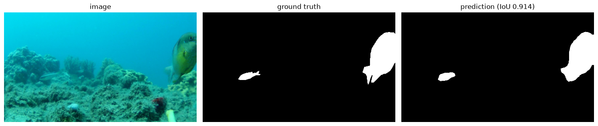
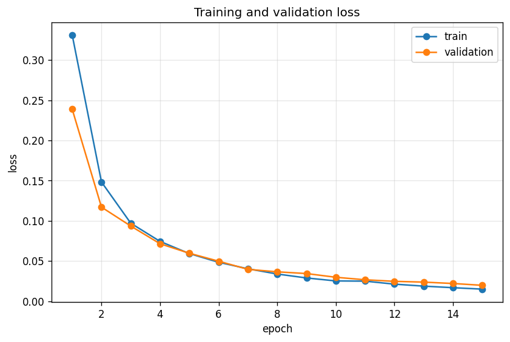
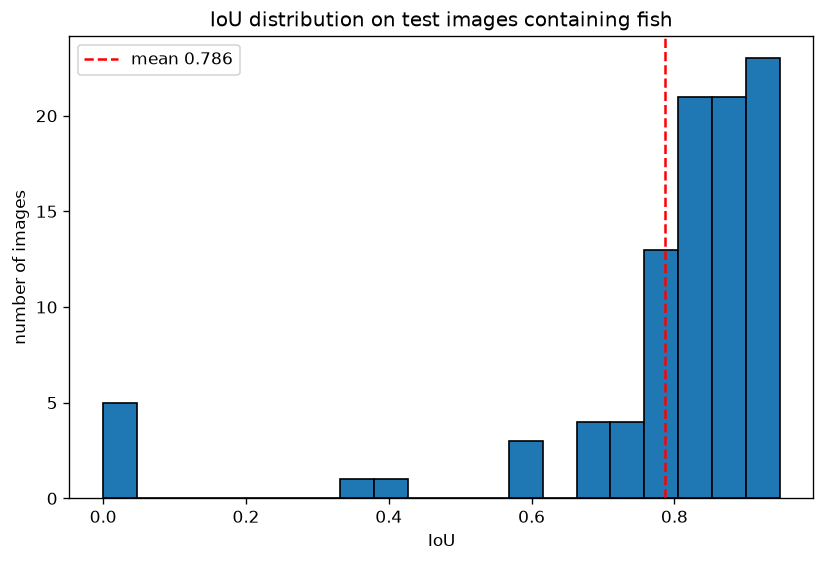
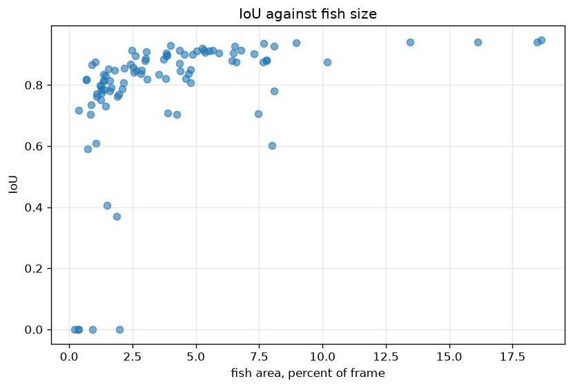

# Fish segmentation


A computer vision model that separates fish from background in underwater
footage, wrapped in a tested inference API. Built to learn how a segmentation
model behaves on real data, and in particular where it stops working.

The interesting part of this project is not the accuracy number. It is the
evaluation. The model scores 0.786 mean IoU overall but 0.24 at one recording
site and 0.91 at another, and that gap holds even after accounting for fish size.



## What it does

Given an underwater image, the model labels every pixel as fish or background and
returns the fraction of the frame covered by fish.

```json
{
  "fish_detected": true,
  "fish_pixels": 1459,
  "fish_coverage_percent": 1.272,
  "mean_confidence": 0.917,
  "original_size": [1920, 1080],
  "inference_ms": 101.1
}
```

Coverage is a population-level signal rather than a per-fish measurement. The
model does semantic segmentation, so overlapping fish merge into one region and
it has no concept of an individual fish.

## Data

[DeepFish](https://alzayats.github.io/DeepFish/) (Saleh et al., 2020), MIT
licensed. The segmentation subset holds 620 underwater images from 20 marine
habitats in tropical Australia, each with a matching binary mask. The published
split is 310 training, 125 validation, 186 test.

Roughly half the images contain no fish. Those are not filler. They teach the
model what an empty scene looks like, which is what keeps it from reporting fish
in empty water.

## Model

DeepLabV3 with a ResNet-50 backbone, pretrained on COCO, with the final
classification layer replaced by a 2-class one. The backbone already understands
edges, textures, and shapes, so only the head needs to learn what a fish is.
Training from scratch on 310 images would not work.

Trained for 15 epochs on a Colab GPU with early stopping and best-checkpoint
saving. Validation loss improved every epoch and never stalled, so early stopping
never fired. Training and validation losses stayed close throughout, which means
no overfitting.



## Results

Measured on the 186 test images the model never saw.

| Metric | Value |
|---|---|
| Mean IoU, images containing fish | 0.786 |
| False positive pixels, empty images | 0 across all 90 |
| Inference time, CPU | 170 to 220 ms |

One note on the headline number. On an empty image with a correct prediction,
intersection and union are both zero, so IoU comes out as 0 even though the model
was right. Half the test set is empty, which drags the overall mean down to 0.406
for reasons that have nothing to do with model quality. The fish-only mean is the
honest figure, and empty images are evaluated separately by whether the model
correctly stays silent.

### Failures cluster rather than spread



The score distribution is bimodal. Most images sit between 0.65 and 0.95, five
sit at exactly zero, and almost nothing falls in between. The model does not
degrade gracefully. It either segments the fish well or misses it entirely.

That matters for what you would do about it. A model that is good most of the
time and blind occasionally needs a different fix than one that is mediocre
everywhere.

### Small fish make failure possible, not certain



Split at the median, the smaller half scores 0.700 and the larger half 0.873.
The scatter shows something sharper than that average suggests. Above about 2.5
percent of frame, scores sit between 0.7 and 0.95 with no upward trend, so size
stops mattering once the fish is big enough. Below that threshold some images
still score above 0.8, but every zero appears there.

### Site matters independently of size

Grouping by habitat, with sites of fewer than three test images excluded.

| Habitat | Images | Mean IoU |
|---|---|---|
| 9870 | 3 | 0.239 |
| 7117 | 3 | 0.272 |
| 9894 | 4 | 0.638 |
| ... | | |
| 7623 | 12 | 0.883 |
| 7482 | 15 | 0.906 |

The obvious objection is that the weak sites might simply contain smaller fish.
Holding size roughly constant by looking only at fish under 2.5 percent of frame,
those two sites score 0.256 against 0.745 elsewhere. Habitat separates
performance on its own.

This is the finding that would matter in deployment. A model reported at 0.79
overall can be failing badly at one specific site while the aggregate number
looks fine.

Caveat worth stating. The two weakest habitats have three test images each, so
they indicate a problem rather than measure it precisely.

## Where the model fails

From manual testing on images outside the test set, including other DeepFish
subsets and underwater photos from the internet. None of these were fixed. With
310 training images from a handful of Australian habitats, they are limits of the
training data rather than bugs.

**Small fish** are sometimes missed entirely, though many are segmented well.

**Camouflaged species** such as grey *Gerres* against sandy substrate are caught
in some frames and missed in others.

**Groups of fish** produce two separate problems. Overlapping fish merge into a
single region, and when fish move in a group some are left out of the mask
altogether.

**Unseen species** are unreliable. A dark fish absent from the training habitats
is detected in some frames and missed in others.

**Different cameras and habitats** degrade performance noticeably. The model
still finds fish but often only some of them, and outlines them incompletely.

**Equipment is occasionally segmented as fish** on external images. This is worth
separating from the misses above because it is the only false positive observed
anywhere, and it does not contradict the zero false positives on the test set.
Those 90 empty images come from habitats the model trained on.

## Running it

Requires the `Segmentation` subset of dataset from the link above, extracted to `data/Segmentation`.

Download the trained weights into `models/`.

```bash
mkdir -p models
curl -L -o models/best_model.pth \
  https://github.com/Furqaan09/fish-segmentation/releases/download/v1.0/best_model.pth
```

```bash
python -m venv .venv && source .venv/bin/activate
pip install -r requirements.txt
uvicorn src.api:app --reload
```

Then open `http://localhost:8000/docs` to upload an image.

With Docker, which needs no local Python setup.

```bash
docker build -t fish-api .
docker run -p 8000:8000 fish-api
```

The image is 1.7 GB, using the CPU-only build of PyTorch. The default build
bundles CUDA support and would add roughly 2 GB for no benefit on a machine
without a GPU.

Inference takes around 100 ms on Apple Silicon, 170 to 220 ms on CPU, and 500 to
700 ms inside Docker Desktop on macOS, where the container runs in a virtual
machine with limited CPU.

The container is ready to deploy but is not currently hosted anywhere.

## Tests

```bash
pytest tests/ -v
```

Twelve tests covering the metric, the dataset, and the API. Tests needing the
dataset or the trained weights skip cleanly in CI, where neither is available.

The one worth pointing out is the performance regression test. It loads the
trained model, scores a fixed set of images, and fails if mean IoU drops below a
threshold or if any empty image produces false positives. Ordinary tests check
that code runs correctly. This one checks that the model is still good, so a
retrain that quietly makes things worse breaks the build instead of going
unnoticed.

## Layout

```
src/
  dataset.py    loading, resizing, mask conversion
  model.py      DeepLabV3 with the 2-class head
  train.py      training and validation loops
  metrics.py    IoU
  predict.py    inference from raw image bytes
  api.py        FastAPI endpoints
notebooks/
  01_explore.ipynb     data checks
  02_pipeline.ipynb    building and verifying each component
  03_train_colab.ipynb full training run on GPU
  04_evaluate.ipynb    scoring and failure analysis
  05_inference.ipynb   testing the inference path
tests/
```

## Prior work on a different dataset

This project originally used a different dataset also called DeepFish, from the
University of Alicante, containing fish market tray images with size
measurements. It was dropped after inspecting it.

The published COCO file lists tray categories with zero annotations, even though
the trays are outlined in 1,254 of the source files. Filenames in the size
measurement CSV lack the `.jpg` extension every other file uses, so joining the
two returns zero rows and raises no error. And 280 of 1,320 images carry no
annotations where the paper reports 29.

A manual audit of 60 images found that 17.9 percent of visible fish are
unlabelled, partly because the authors deliberately labelled only species of
commercial interest.

None of that is unusable, but it meant several days of data repair before any
model could be trained, and the images are dead fish on market trays rather than
live fish underwater. The Australian dataset is a closer match to the problem and
ships ready to use, so the work moved there.

## Limitations

- Semantic segmentation only. It cannot count individual fish or measure one.
- 310 training images from a small number of habitats, so generalisation to new
  sites is weak.
- Coverage percentage is a proxy for biomass, not a calibrated measurement.
- No image augmentation. Adding it would likely help with the domain shift
  problems above, and is the first thing worth trying next.
